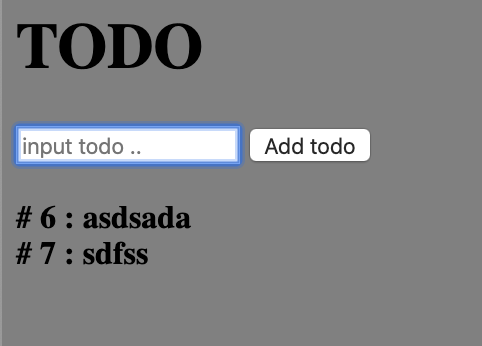

# Frameworkless todo app

No webpack, no transpiling, no nothing. 

This is a todo app with no framework whatsoever. 

I have only used JavaScript, css and html.

## How to run

    npm i -g serve
    serve -s .

open http://localhost:5000

